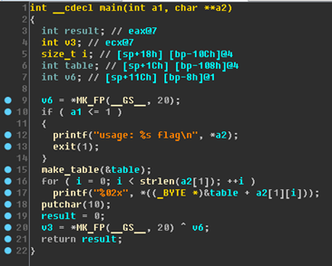
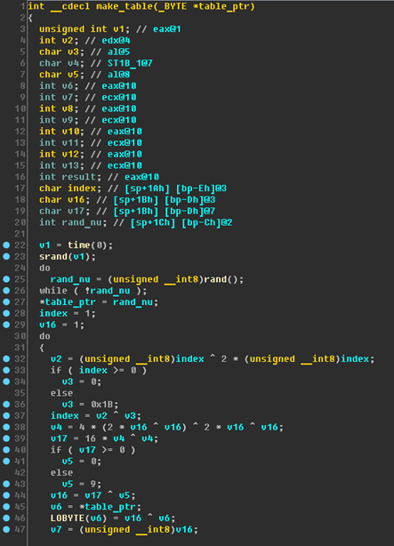
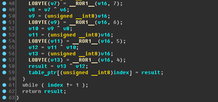

# reverse box

## Problem

這題給了一個ELF執行檔，根據題目(上圖)可以知道，在執行時的後面加上flag，它會噴出一串奇怪的字串。   

## Solution

將檔案拖進IDA PRO分析:   

從這裡可以看到它會先在第15行建一個表，然後再根據輸入字串每個字的ASCII查表輸出，例如: a2=”abc”，那它就會輸出table[97] table[98] table[99]，因此當得知表的內容後，就可以直接反推FLAG字串。   

接來下看看make_table在做什麼:   

make_table大略是先依照現在時間選一個亂數表，然後再取出一個亂數給table_ptr後，再進行一連串奇怪的運算，最後建出一張表。   
本來如果一直都是同一張表的話，可以直接反推，但現在是亂數建表，所以我們要先找出題目執行時的那張表。   

怎麼找呢？我們可以根據這次比賽flag的格式( TWCTF{ )，得知table[‘T’]=95 ,table[‘W’]=ee ,table[‘C’]=af ,table[‘T’]=95 ,table[‘F’]=ef ,table[‘{‘]=94，因此我們找出一張表，能匹配上面位置的值，我們就成功找到表了。   
而根據第25行，取亂數時有定義型態為(unsigned __int8)，因此亂數只從0~255，總共只有256張表。   

最後根據上面得到的資訊，寫了一個程式([pass.c](pass.c))，大致是從0~255依序建表，然後每建好一個表，就做一次檢查，檢查跟題目的表有沒有匹配，有的話就將全部的flag反推出來。   

