# note

## gdb

### Start
有無 `-q` 的差別 (quick)
```
$ gdb helloworld.exe
GNU gdb (GDB) 7.6.1
Copyright (C) 2013 Free Software Foundation, Inc.
License GPLv3+: GNU GPL version 3 or later <http://gnu.org/licenses/gpl.html>
This is free software: you are free to change and redistribute it.
There is NO WARRANTY, to the extent permitted by law.  Type "show copying"
and "show warranty" for details.
This GDB was configured as "mingw32".
For bug reporting instructions, please see:
<http://www.gnu.org/software/gdb/bugs/>...
Reading symbols from test\helloworld.exe...(no debugging symbols found)...done.
(gdb)

$ gdb -q helloworld.exe
Reading symbols from test\helloworld.exe...(no debugging symbols found)...done.
(gdb)
```
### Run
使用 `r` 執行時，會直接跑到最後，用 `start` 的話，會停在入口點。
```
(gdb) r
Starting program: test/helloworld.exe
[New Thread 8636.0x1798]
0
Hello World
[Inferior 1 (process 8636) exited normally

(gdb) start
Temporary breakpoint 1 at 0x40150b
Starting program: test/helloworld.exe
[New Thread 5512.0x1eec]

Temporary breakpoint 1, 0x0040150b in main ()
```

### step
step (s): step into，當執行到function時會跟進去  
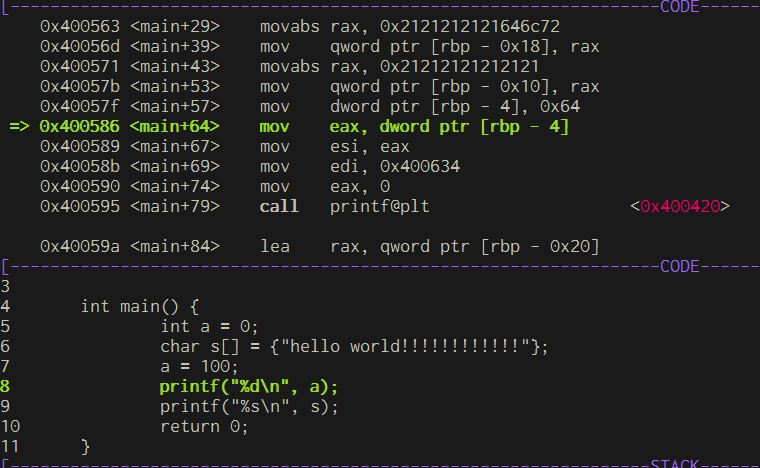  
  
step instrution (si): 同上，但是每次只執行一行指令  
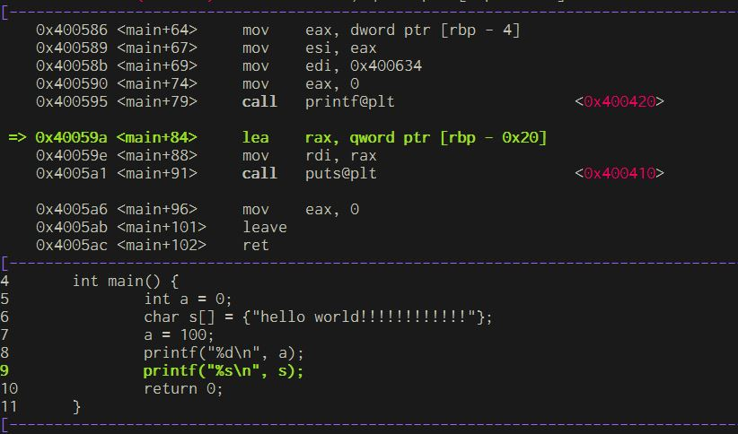  
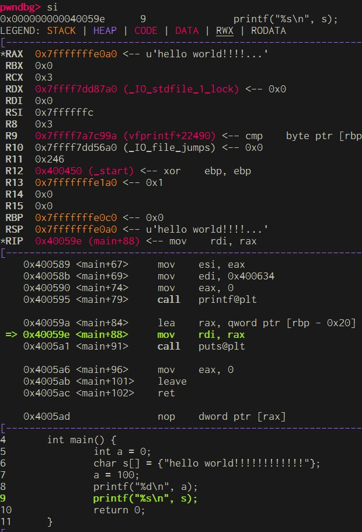  
next (n): step over，當執行到function時不會跟進去  
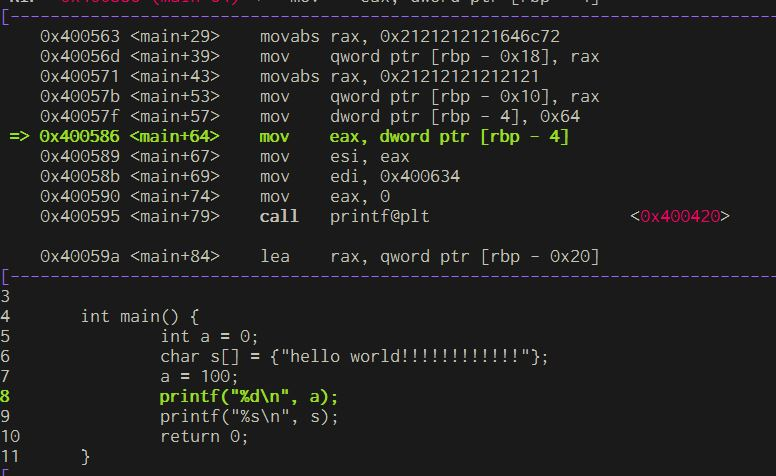  
  
next instrution (ni): 同上，但是每次只執行一行指令   
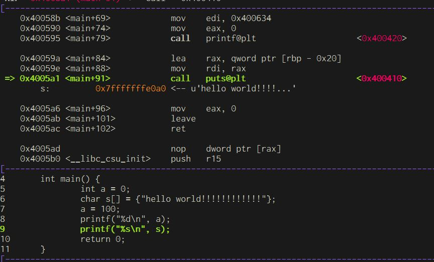  
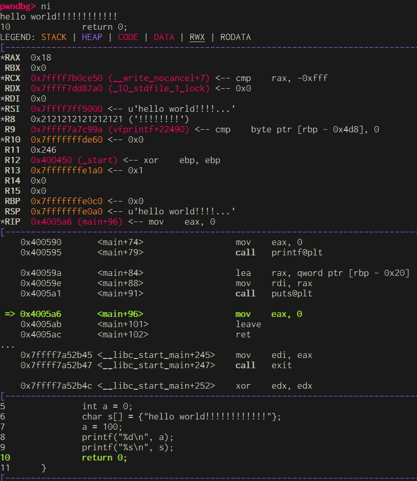  
cntinue (c): continue  
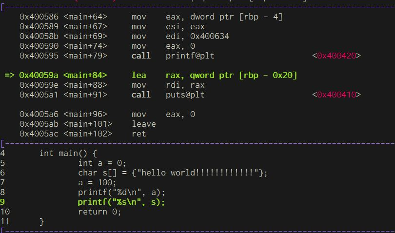  
  
finish (fin): 執行到當前的function返回   
  
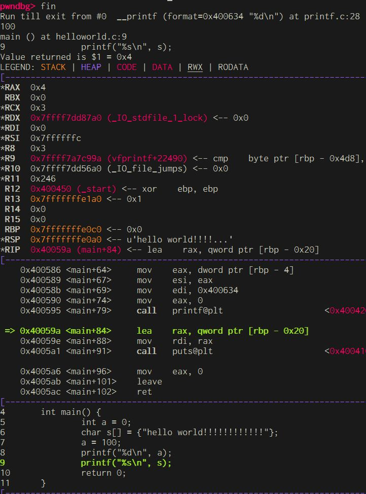  


### break
break (b): 設置中斷  
info break: 觀看當前中斷列表  
enable [num]: 開啟中斷  
disable [num]: 關閉中斷  
```
(gdb) info break
No breakpoints or watchpoints.
(gdb) b *main
Breakpoint 2 at 0x401508
(gdb) info break
Num     Type           Disp Enb Address    What
2       breakpoint     keep y   0x00401508 <main>
(gdb) disable 2
(gdb) info break
Num     Type           Disp Enb Address    What
2       breakpoint     keep n   0x00401508 <main>
(gdb) enable 2
(gdb) info break
Num     Type           Disp Enb Address    What
2       breakpoint     keep y   0x00401508 <main>
```

### memory
x /[Length][Format] [Address expression]  
`x/16xw`  
x: display memory  
32: 顯示16個  
Format: 
* o - octal  
* x - hexadecimal  
* d - decimal  
* u - unsigned decimal  
* t - binary  
* f - floating point  
* a - address  
* c - char  
* s - string  
* i - instruction 

Address expression:  
* b - byte  
* h - halfword (16-bit value)  
* w - word (32-bit value)  
* g - giant word (64-bit value)  
```
(gdb) x $esp
0x28ff50:       0x00000001
(gdb) x/w $esp
(gdb) x/xw $esp
0x28ff50:       0x00000001
(gdb) x/16xw $esp
0x28ff50:       0x00000001      0x003417f0      0x00341ae8      0x0028ff68
0x28ff60:       0x74cb2811      0x00000001      0x7efde000      0x004012f5
0x28ff70:       0x00000001      0x00000000      0x00000000      0x00000000
0x28ff80:       0x00000000      0x00000000      0x00000000      0x7694336a
```

### print
print (p): 顯示某變數或記憶體的值
```
(gdb) p $eip
$3 = (void (*)()) 0x40150b <main+3>
(gdb) p /x 0x40150b
$9 = 0x40150b
(gdb) p /x *0x40150b
$10 = 0xe8f0e483
```

### display
display: 設定後，每次執行命令時都會顯示變數內容
undisplay: 取消顯示
```
pwndbg> display a
1: a = 0x0
pwndbg> n
8               printf("%d\n", a);
1: a = 0x64
pwndbg> info display
Auto-display expressions now in effect:
Num Enb Expression
1:   y  a
pwndbg> undisplay 1
pwndbg> info display
There are no auto-display expressions now.

```

### set
set: 設定變數的值
```
(gdb) set $test = 100
(gdb) p $test
$5 = 100
```

### record
record: 從執行命令後開始紀錄  
rs, rsi, rn, rni, rs, rc: 同原功能，只是變成返回
執行record  
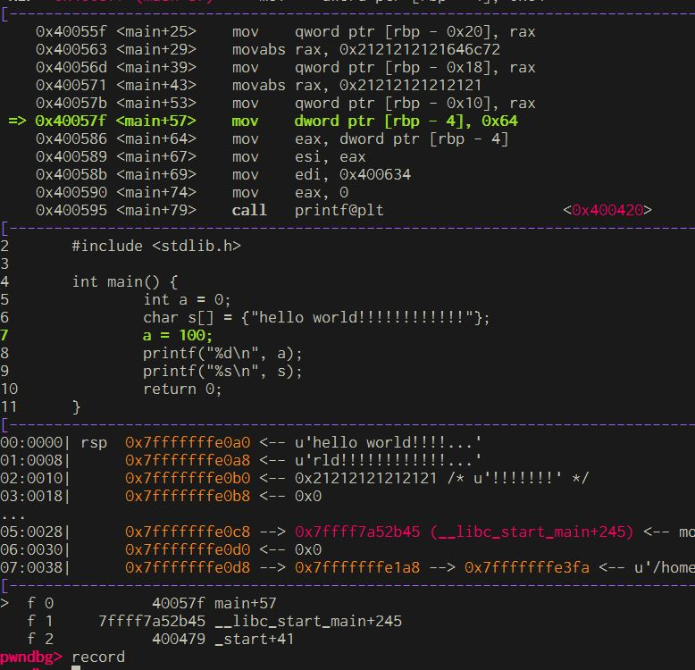  
執行一些指令後  
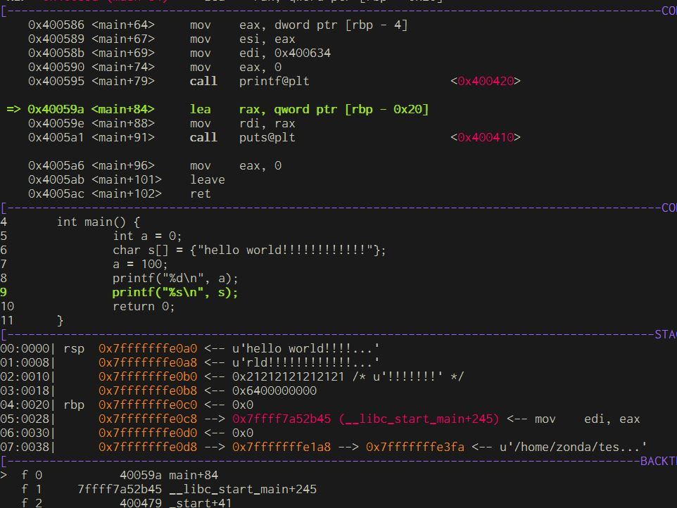  
使用rs  
  
使用rn前的狀態  
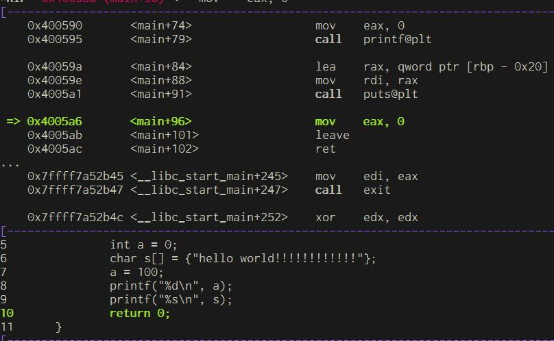  
使用rn後  
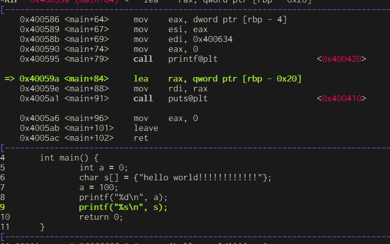  

### attach
```
$ pidof helloworld
9687
$ gdb -q
Loaded 93 commands.  Type pwndbg for a list.
pwndbg> attach 9687
Attaching to process 9687
Reading symbols from /home/zonda/test/gdb_test/helloworld...done.
Reading symbols from /lib/x86_64-linux-gnu/libc.so.6...Reading symbols from /usr/lib/debug//lib/x86_64-linux-gnu/libc-2.19.so...done.
done.
Loaded symbols for /lib/x86_64-linux-gnu/libc.so.6
Reading symbols from /lib64/ld-linux-x86-64.so.2...Reading symbols from /usr/lib/debug//lib/x86_64-linux-gnu/ld-2.19.so...done.
done.
Loaded symbols for /lib64/ld-linux-x86-64.so.2
0x00007fa732bc0df0 in __read_nocancel () at ../sysdeps/unix/syscall-template.S:81

```

### gdbscript
建立一個檔案，裡面打gdb的指令，使用方式
```
pwndbg> source gdbscript
```

### gdb server
```
$ gdbserver 127.0.0.1:4444 ./binary

gdb ./binary
$ target remote 127.0.0.1:4444
$ continue

$ ncat –vc ‘gdbserver 127.0.0.1:4444 ./binary’ –kl 127.0.0.1 8888
```

## qira

### start
預設web是3002，socat是4000
```
$ qira -s ./helloworld
*** program is /home/zonda/test/gdb_test/helloworld with hash dfaf194feb0a161b10b67861b6c5267499be8042
**** using /home/zonda/qira-1.2/tracers/qemu/qemu-2.1.3/x86_64-linux-user/qemu-x86_64 for 0x3e
no qira server found, starting it
*** deleting old runs
**** listening on <socket fileno=7 sock=0.0.0.0:4000>
****** starting WEB SERVER on 0.0.0.0:3002

$ qira --host 127.0.0.1 --web-port 8888 --socat-port 9999 -s .
/helloworld
*** program is /home/zonda/test/gdb_test/helloworld with hash dfaf194feb0a161b10b67861b6c5267499be8042
**** using /home/zonda/qira-1.2/tracers/qemu/qemu-2.1.3/x86_64-linux-user/qemu-x86_64 for 0x3e
no qira server found, starting it
*** deleting old runs
****** starting WEB SERVER on 127.0.0.1:8888
**** listening on <socket fileno=7 sock=127.0.0.1:9999>
**** listening on <socket fileno=7 sock=127.0.0.1:9999>

```

### keyboard
n: 幫instruction加上名稱  
  
  
shift+n: 幫data加上名稱  
  
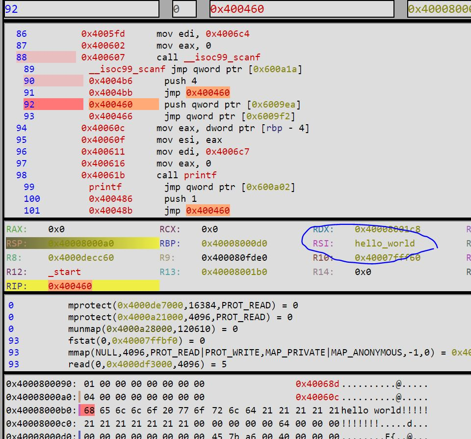  
`:`: 幫data加上名稱  
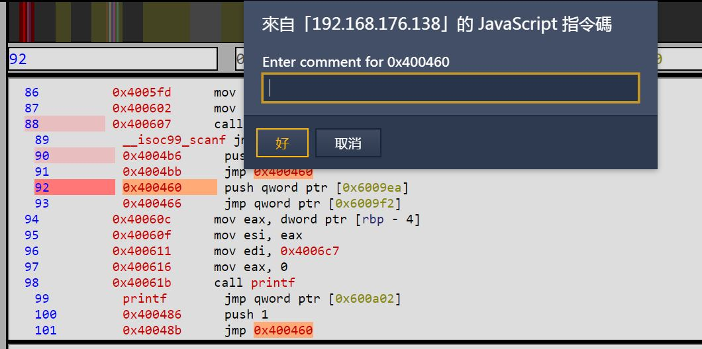  
  

## checksec

ASLR (Addess Space Layout Randomization)：
位置記憶體空間隨機載入。
關閉方式
```
sudo bash -c 'echo 0 > /proc/sys/kernel/randomize_va_space'
```

RELRO:  
讓GOT變read only。
```
不開
gcc -z norelro -o helloworld helloworld.c
半開
gcc -z relro -o helloworld helloworld.c
全開
gcc -z relro -z now -o helloworld helloworld.c
```
STACK CANARY:  
stack保護，主要防止bof，他會在程式開始時，跟系統要一個值，放在stack上，結束前，檢查這個值有沒有被改變。  
```
開啟保護
gcc -fstack-protector -o helloworld helloworld.c
關閉保護
gcc -fno-stack-protector -o helloworld helloworld.c
```
NX:  
也就是DEP，用來防止shellcode，他會讓程式可寫的地方不可執行，可執行的地方不可以寫。
```
開啟保護
gcc -z noexecstack -o helloworld helloworld.c
關閉保護
$ gcc -z execstack -o helloworld helloworld.c
```  
PIE:  
讓程式.text區段有ASLR。 
```
開啟保護
gcc -fPIE -pie -o helloworld helloworld.c
``` 
FORTIFY: 一種防止bof的東西，我也不太懂  
```
$ checksec --file helloworld
RELRO           STACK CANARY      NX            PIE             RPATH      RUNPATH      FORTIFY Fortified Fortifiable  FILE
No RELRO        No canary found   NX enabled    No PIE          No RPATH   No RUNPATH   No      0               2       helloworld

```

## Compiler  
32位元編譯錯誤時  
```
sudo apt-get install gcc-multilib g++-multilib
```

編譯含有debug symbol的libc:  
64 bit
```
cd glibc-2.19 && mkdir bulid && cd build
CFLAGS=”-g -g3 -ggdb -gdwarf-4 -Og” \
CXXFLAGS=”-g -g3 -ggdb -gdwarf-4 -Og” \
../configure --prefix=/path/to/install
```
32 bit
```
cd glibc-2.19 && mkdir bulid32 && cd build32
CC=”gcc -m32” CXX=”g++ -m32” \
CFLAGS=”-g -g3 -ggdb -gdwarf-4 -Og” \
CXXFLAGS=”-g -g3 -ggdb -gdwarf-4 -Og” \
../configure --prefix=/path/to/install --host=i686-linux-gnu

```